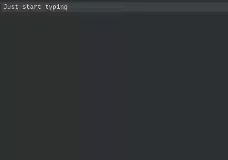

# Snippets plugin for Inkdrop

[](https://dev.azure.com/jmerle/inkdrop-snippets/_build/latest?definitionId=28&branchName=master)
[](https://my.inkdrop.app/plugins/snippets)
[](https://github.com/jmerle/inkdrop-snippets/blob/master/LICENSE)



This plugin makes it easy to create and use snippets inside Inkdrop notes.

## Install

```
ipm install snippets
```

## Usage

After installing the extension, click on Plugins > Snippets > Create new configuration note. This creates a new note in which snippets can be configured. Alternatively, if you already have a configuration note containing snippets you want to register, simply right-click on it in the note list and select "(Un)register as snippets configuration".

Snippets configuration is done in JavaScript with configuration notes looking like this (surrounded by "\```js" and "\```"):

```js
[
    // Example 1: static snippet which prints "Snippets"
    {
        trigger: 'snippet',
        content: 'Snippets',
    },

    // Example 2: dynamic snippet which prints a formatted timestamp
    {
        trigger: 'timestamp',
        content: () => format(new Date(), 'dd-MM-yyyy HH:mm:ss'),
    },

    // Example 3: multi-line snippet with placeholders
    {
        trigger: 'header',
        content: `
---
layout: $2:none$
title: $1$
---
$3$
        `.trim(),
    },
];
```

### Trigger

Type: `string`  
Required: Yes

The text that should activate the snippet. When the trigger is typed and the activation key is pressed (default: <kbd>Tab</kbd>), the snippet is executed and the trigger is replaced by the snippet's content.

When there are multiple snippets with the same trigger, the last registered one will be used. Snippet configuration notes are read in the order of the note ids in the plugin's settings. Snippets in configuration notes are registered from top to bottom.

### Content

Type: `string` or `() => string` or `() => Promise<string>`  
Required: Yes

The content with which the trigger should be replaced with.
If it is a JavaScript function, it is called with the current selection and the return value is used as content.
If a Promise is returned, the plugin waits for the promise to resolve.

The content may contain tokens like `$1$` and `$2$` to define placeholders. Placeholders can contain default values by defining them like `$1:Default value$`. When the snippet is executed, the cursor will move to the first placeholder. Placeholders can be jumped between with <kbd>Tab</kbd> and <kbd>Shift+Tab</kbd> by default. If no placeholders are defined, the cursor will move to the end of the content when the snippet is executed.

To make working with `Date` objects easier, all functions from the [date-fns](https://date-fns.org/) library are available.

## Commands

The following commands are available:

| Command                         | Description                                                | Default keybinding                     |
| ------------------------------- | ---------------------------------------------------------- | -------------------------------------- |
| `snippets:run`                  | Checks if typed text matches a trigger, runs snippet if so | <kbd>Tab</kbd>                         |
| `snippets:run-<trigger>`        | Runs snippet with given trigger                            |                                        |
| `snippets:next-placeholder`     | Moves cursor to next placeholder                           | The keybinding bound to `snippets:run` |
| `snippets:previous-placeholder` | Moves cursor to previous placeholder                       | <kbd>Shift</kbd> + <kbd>Tab</kbd>      |

Keybindings bound to `snippets:*` commands fall through. This means that even while <kbd>Tab</kbd> is bound to `snippets:run` by default, if no trigger has been typed the next command bound to <kbd>Tab</kbd> will be ran (usually `editor:indent`).

## Changelog

See the [GitHub releases](https://github.com/jmerle/inkdrop-snippets/releases) for an overview of what changed in each update.

## Contributing

All contributions are welcome. Please read the [Contributing Guide](https://github.com/jmerle/inkdrop-snippets/blob/master/CONTRIBUTING.md) first as it contains information regarding the tools used by the project and instructions on how to set up a development environment.
