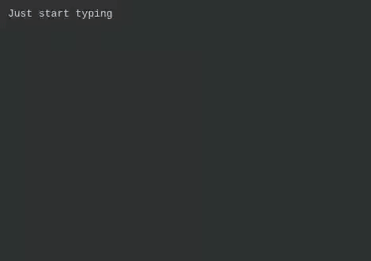

# Demo GIF



The demo gif is created using [Peek](https://github.com/phw/peek) and [pyautogui](https://github.com/asweigart/pyautogui).

## Steps

Make sure the following snippets are registered:

```js
[
    {
        trigger: 'hello',
        content: 'Hello, world!',
    },

    {
        trigger: 'day',
        content: () => format(new Date(), 'dd-MM-yyyy'),
    },

    {
        trigger: 'name',
        content: 'My first name is $1:John$ and my last name is $2$',
    }
]
```

After that, follow these steps:

1. Open Inkdrop and create a new note.
2. Start Peek and position it above the new note. You may have to repeat these steps a few times to get the size right.
3. Ensure Peek is configured to record in 30 fps.
4. Run the `demo.py` script.
5. Within 5 seconds of the previous step, move the cursor on top of Peek's record button.
6. As soon as Peek starts counting down, move the cursor inside the Peek recording window so that it's on top of Inkdrop.
7. As soon as the typing starts, move the cursor on top of Peek's "Stop" button.
8. Wait until the script is done, it will automatically press the "Stop" button.
